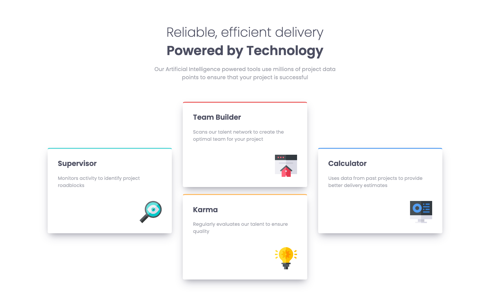

# Frontend Mentor - Four card feature section solution

This is a solution to the [Four card feature section challenge on Frontend Mentor](https://www.frontendmentor.io/challenges/four-card-feature-section-weK1eFYK). Frontend Mentor challenges help you improve your coding skills by building realistic projects.
improve your coding skills by building realistic projects.

## Table of contents

- [Overview](#overview)
  - [Screenshot](#screenshot)
  - [Links](#links)
- [My process](#my-process)
  - [Built with](#built-with)
- [Author](#author)

## Overview

### Screenshot

### Links

- Solution URL: [solution](https://github.com/nguyensylvie/four-card)
- Live Site URL: [live site](https://nguyensylvie.github.io/four-card)

## My process

### Built with

- HTML
- SASS
- Bootstrap

## Author

- Frontend Mentor - [@nguyensylvie](https://www.frontendmentor.io/profile/nguyensylvie)
